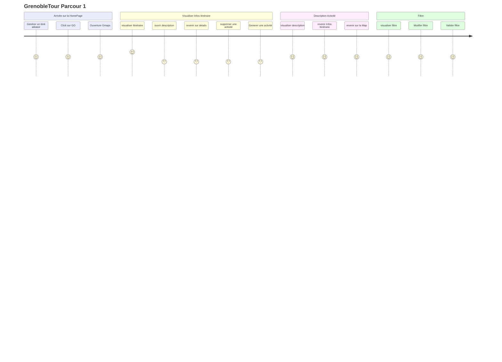

# Nom de l'Application: GrenobleTour (on dirait le tour de France , non!!!)

```
Création de parcours(itinéraire), la navigation GPS, les détails des lieux d'intérêt, la liste des événements et la prise en charge de plusieurs langues.
```

## Description
GrenobleTour est une application mobile 100% gratuite conçue pour vous aider à explorer la ville de Grenoble, que ce soit à pied ou en utilisant les transports en commun en proposant des parcours personnalisables.

Cette application fait office de guide touristique numérique ainsi que d'un carnet de route pratique et facile à utiliser. Elle réunit une communauté de visiteurs de Grenoble désireux de s'inspirer, de partager leurs expériences et de se laisser guider en toute tranquillité.

## Objectif

L'objectif principal de l'application GrenobleTour est de fournir une plateforme conviviale offrant une carte géographique mettant en évidence les parcours(itinéraire), la navigation GPS, les détails des lieux d'intérêt, la liste des événements et la prise en charge de plusieurs langues.  L'accent est mis sur la simplicité et la légèreté de l'interface utilisateur, garantissant ainsi une expérience fluide sans surcharger les utilisateurs avec une multitude d'informations


## Public Cible
L'application s'adresse aux familles, aux individus adultes résidents ou en visite à Grenoble pour un court séjour, allant d'une demi-journée à trois jours.


## Besoins fonctionnels

L'application GrenobleTour peut proposer plusieurs fonctionnalités pour offrir une expérience complète aux utilisateurs qui souhaitent explorer la ville de Grenoble. Voici une liste de fonctionnalités potentielles pour notre application :

### Création de Parcours :
Possibilité pour les utilisateurs de créer leurs propres itinéraires en sélectionnant des lieux d'intérêt.
### Navigation GPS :
- Guidage GPS pour suivre un parcours ou se rendre à un lieu d'intérêt.
- Calcul de l'itinéraire en fonction du mode de transport choisi (à pied, en transports en commun, etc).
### Événements et Activités :
Liste des événements en cours ou à venir à Grenoble.
Détails sur les événements, y compris les dates, les lieux et les descriptions.
### Détails des Lieux d'Intérêt :
Page détaillée pour chaque lieu d'intérêt avec des informations telles que l'adresse, la description, les horaires d'ouverture, les avis des utilisateurs, les photos, etc.
### Langues Multiples :
Prise en charge de plusieurs langues pour atteindre un public international.


## Application de Référence
Vous pouvez consulter l'application
- Visitacity (https://www.visitacity.com/) comme exemple de ce que nous souhaitons accomplir avec GrenobleTour
- Decathlon Outdoor : pour s'inspirer sur le plan ergonomique


# Diagramme de cas d’utilisation
# User Journey Map 
Voici quelques exemples de parcours utilisateur (user journeys) pour l'application GrenobleTour.
