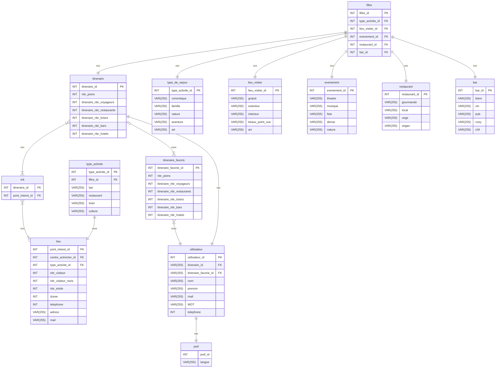

```dbdiagram
// Use DBML to define your database structure
// Docs: https://dbml.dbdiagram.io/docs
// les machin bidul truc qui permet de les reliers je ne me rappel plus du sens


table filtre{
  filtre_id PK
  type_activite_id FK
  lieu_visiter_id FK
  evenement_id FK
  restaurant_id FK
  bar_id FK
}
table type_de_sejour{
  type_activite_id PK
  romentique varchar(255)
  famille varchar(255)
  nature varchar(255)
  aventure varchar(255)
  art varchar(255)
}
table lieu_visiter{
  lieu_visiter_id PK
  gratuit varchar(255)
  exterieur varchar(255)
  interieur varchar(255)
  beaux_point_vue varchar(255)
  art varchar(255)
}
table evenement{
  evenement_id PK
  theatre varchar(255)
  musique varchar(255)
  fete varchar(255)
  dense varchar(255)
  nature varchar(255)
}
table restaurant{
  restaurant_id PK
  gourmande varchar(255)
  local varchar(255)
  vege varchar(255)
  vegan varchar(255)
}
table bar{
  bar_id PK
  biere varchar(255)
  vin varchar(255)
  pub varchar(255)
  cosy varchar(255)
  chil varchar(255)
}

Table utilisateur { // client
  utilisateur_id PK
  itineraire_id FK
  itineraire_favorie_id FK
  nom varchar(255)
  prenom varchar(255)
  mail varchar(255)
  MOT varchar(255)
  telephone int 
}

table init{
  itineraire_id FK
  pont_interet_id FK
}

table type_activite{
  type_activite_id PK
  filtre_id FK
  bar varchar(255)
  restaurant varchar(255)
  loisir varchar(255)
  culture varchar(255)
}

Table  lieu {
  lieu_id PK
  centre_activicter_id FK 
  type_activite_id FK
  nbr_visiteur int
  nbr_visiteur_mois int 
  nbr_etoile int
  duree int
  telephone int 
  adress varchar(255)
  mail varchar(255)
}

table pref{
  pref_id PK
  langue varchar(255)
}

Table itineraire { 
  itineraire_id PK

  itineraire_nbr_voyageurs int
  itineraire_nbr_restaurants int
  itineraire_nbr_loisirs int
  itineraire_nbr_bars int
  itineraire_nbr_hotels int
}

table itineraire_favorie {
  itineraire_favorie_id PK

  itineraire_nbr_voyageurs int
  itineraire_nbr_restaurants int
  itineraire_nbr_loisirs int
  itineraire_nbr_bars int
  itineraire_nbr_hotels int

}

```