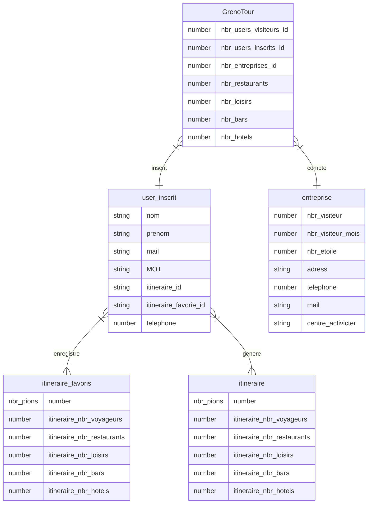
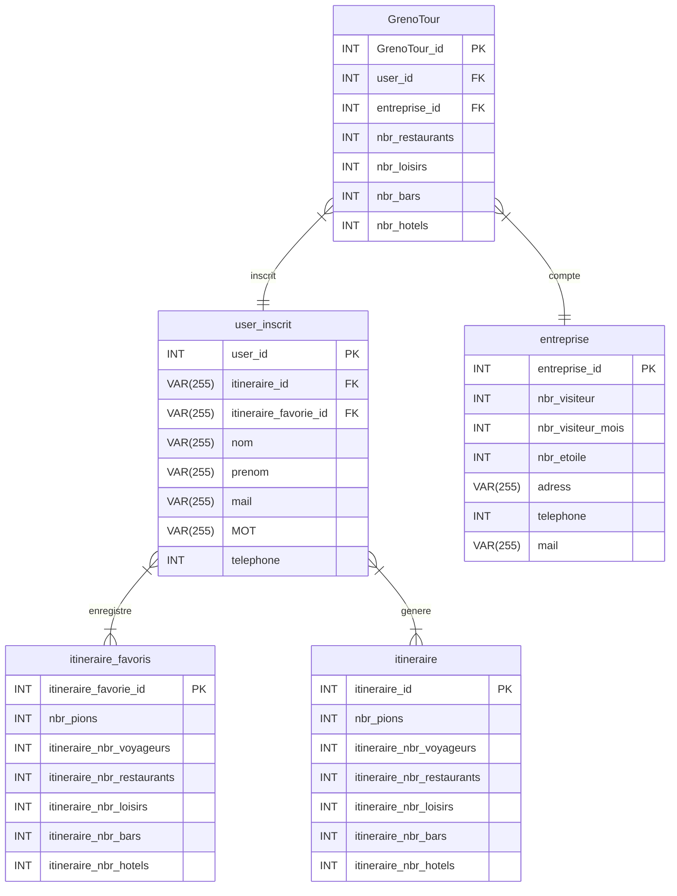

## MCD 1



## MCD 2




## Schéma de la base de données 1

https://dbdiagram.io/d/

```
// Use DBML to define your database structure
// Docs: https://dbml.dbdiagram.io/docs
// les machin bidul truc qui permet de les reliers je ne me rappel plus du sens

Table user_visiteur { // pas sur de cette table
  id integer [primary key]
  nom varchar(255)
  prenom varchar(255) 
  heur_avant_delete number
  itineraire_id integer
}

Table user_inscrit { // client
  id integer [primary key]
  nom varchar(255)
  prenom varchar(255)
  mail varchar(255)
  MOT varchar(255)
  itineraire_id integer
  itineraire_favorie_id integer
  telephone number
}

Table entreprise { // entreprise/perso
  id integer [primary key]
  nbr_visiteur number
  nbr_visiteur_mois number
  nbr_etoile number
  adress varchar(255)
  telephone number
  mail varchar(255)
  centre_activicter [key]
  lien_site string // ?
}

Table centre_activicter {
  id integer [primary key]
}

Table GrenoTour { // perso
  id integer [primary key]
  nbr_users_visiteurs_id number
  nbr_users_inscrits_id number
  nbr_entreprises_id number
  nbr_restaurants number
  nbr_loisirs number
  nbr_bars number
  nbr_hotels number
}

Table itineraire { // client
  id integer [primary key]
  nbr_pions number
  itineraire_nbr_voyageurs number
  itineraire_nbr_restaurants number
  itineraire_nbr_loisirs number
  itineraire_nbr_bars number
  itineraire_nbr_hotels number
}

table itineraire_favorie {
  id integer [primary key]
  nbr_pions number
  itineraire_nbr_voyageurs number
  itineraire_nbr_restaurants number
  itineraire_nbr_loisirs number
  itineraire_nbr_bars number
  itineraire_nbr_hotels number
}

Ref: "user_inscrit"."itineraire_favorie_id" < "itineraire_favorie"."id"

Ref: "GrenoTour"."nbr_users_inscrits_id" < "user_inscrit"."id"

Ref: "GrenoTour"."nbr_entreprises_id" < "entreprise"."id"

Ref: "user_inscrit"."itineraire_id" < "itineraire"."id"

Ref: "GrenoTour"."nbr_users_visiteurs_id" < "user_visiteur"."id"

Ref: "user_visiteur"."itineraire_id" < "itineraire"."id"
```


## Schéma de la base de données 2
https://dbdiagram.io/d/

https://dbdiagram.io/d/64eddd4b02bd1c4a5e9b1247
```


// Use DBML to define your database structure
// Docs: https://dbml.dbdiagram.io/docs
// les machin bidul truc qui permet de les reliers je ne me rappel plus du sens

// Table user_visiteur { // pas sur de cette table
//   id integer [primary key]
  // nom varchar(255)
  // prenom varchar(255) 
//   heur_avant_delete number
//   itineraire_id integer
// }

Table user_inscrit { // client
  id PK
  
  itineraire_id FK
  itineraire_favorie_id FK

  nom varchar(255)
  prenom varchar(255)
  mail varchar(255)
  MOT varchar(255)
  telephone int
}

Table entreprise {
  id integer PK

  nbr_visiteur int
  nbr_visiteur_mois int
  nbr_etoile int
  adress varchar(255)
  telephone int
  mail varchar(255)
}

Table centre_activicter {
  id integer [primary key]
}

Table GrenoTour { 
  id PK

  nbr_users_visiteurs_id int
  nbr_users_inscrits_id int
  nbr_entreprises_id int
  nbr_restaurants int // doute
  nbr_loisirs int // doute
  nbr_bars int // doute
  nbr_hotels int // doute
}

Table itineraire { // client
  id PK

  nbr_pions int
  itineraire_nbr_voyageurs int
  itineraire_nbr_restaurants int
  itineraire_nbr_loisirs int
  itineraire_nbr_bars int
  itineraire_nbr_hotels int
}

table itineraire_favorie {
  id PK

  nbr_pions int
  itineraire_nbr_voyageurs int
  itineraire_nbr_restaurants int
  itineraire_nbr_loisirs int
  itineraire_nbr_bars int
  itineraire_nbr_hotels int
}

Ref: "user_inscrit"."itineraire_favorie_id" < "itineraire_favorie"."id"

Ref: "GrenoTour"."nbr_users_inscrits_id" < "user_inscrit"."id"

Ref: "GrenoTour"."nbr_entreprises_id" < "entreprise"."id"

Ref: "user_inscrit"."itineraire_id" < "itineraire"."id"
```
