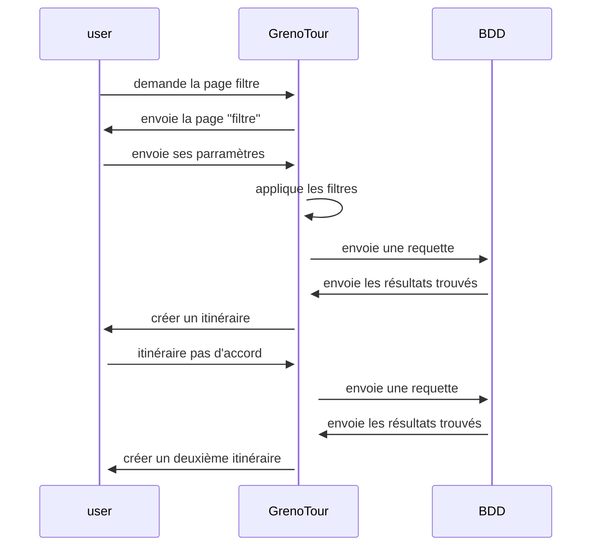

# 1 sequence simple de la page filtre 

```mermaid
sequenceDiagram
    user->>+GrenoTour: demande la page filtre
    GrenoTour->>+user: envoie la page "filtre"
    user->>+GrenoTour: envoie ses parramètres 
    GrenoTour->>+GrenoTour: applique les filtres
    GrenoTour->>+BDD: envoie une requette
    BDD->>+GrenoTour: envoie les résultats trouvés
    GrenoTour->>+user: créer un itinéraire
    user->>+GrenoTour: itinéraire pas d'accord
    GrenoTour->>+BDD: envoie une requette
    BDD->>+GrenoTour: envoie les résultats trouvés
    GrenoTour->>+user: créer un deuxième itinéraire
```
