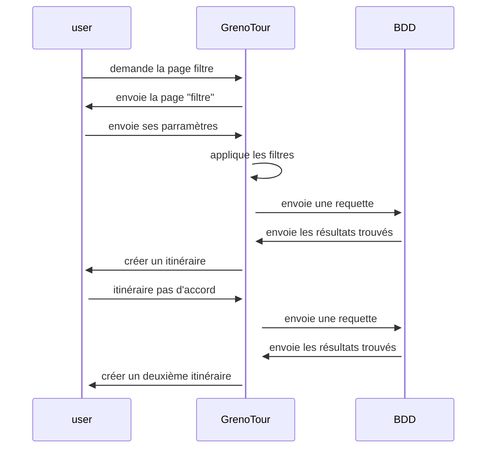
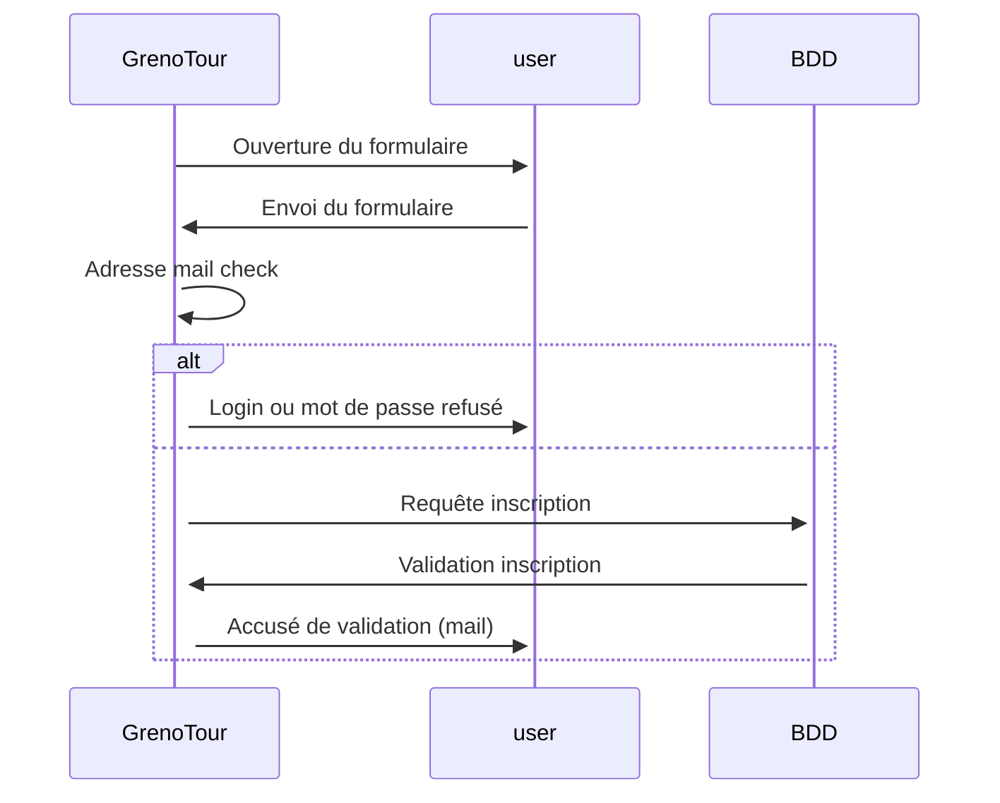

# 1 Séquence génération d'itinéraire

```mermaid
sequenceDiagram
    user->>+GrenoTour: demande la page filtre
    GrenoTour->>+user: envoie la page "filtre"
    user->>+GrenoTour: envoie ses parramètres 
    GrenoTour->>+GrenoTour: applique les filtres
    GrenoTour->>+BDD: envoie une requette
    BDD->>+GrenoTour: envoie les résultats trouvés
    GrenoTour->>+user: créer un itinéraire
    user->>+GrenoTour: itinéraire pas d'accord
    GrenoTour->>+BDD: envoie une requette
    BDD->>+GrenoTour: envoie les résultats trouvés
    GrenoTour->>+user: créer un deuxième itinéraire
```

# 2 Séquence inscription d'un nouvel utilisateur

```mermaid
sequenceDiagram
    GrenoTour->>+user: Ouverture du formulaire
    user->>+GrenoTour: Envoi du formulaire
    GrenoTour->>+GrenoTour: Adresse mail check
    alt
        GrenoTour->>+user: Login ou mot de passe refusé 
    else
        GrenoTour->>+BDD: Requête inscription
    BDD->>+GrenoTour: Validation inscription
    GrenoTour->>+user: Accusé de validation (mail)
    end
```

# 3 Séquence authentification

# 4 Séquence enregistrement (favoris) et partage d'un itinéraire