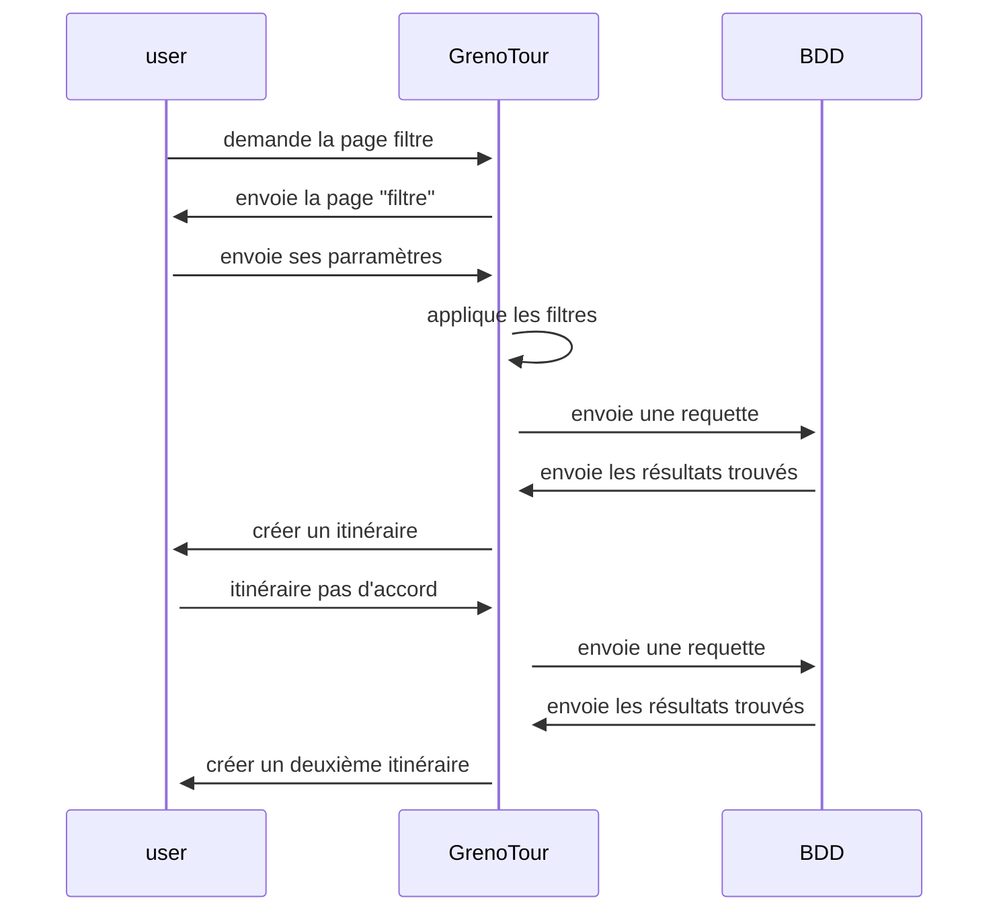
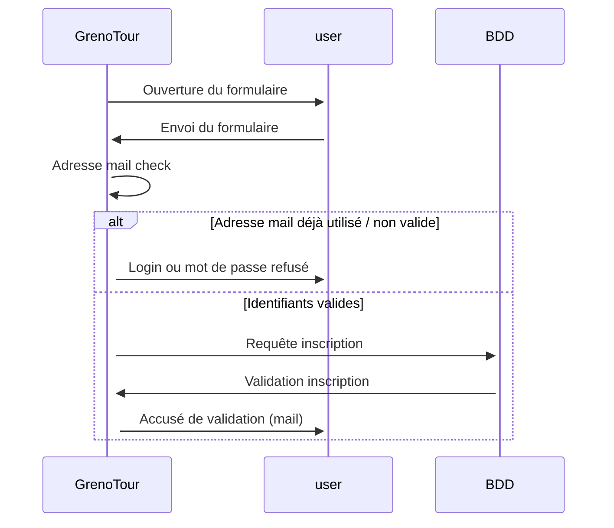

# 1 Séquence génération d'itinéraire



# 2 Séquence inscription d'un nouvel utilisateur



# 3 Séquence authentification
 
 ```mermaid
 sequenceDiagram
    User->>+GrenoTour: Demande d'authentification
    User->>+GrenoTour: Saisir mot de passe et login
    GrenoTour->>+GrenoTour: Adresse mail check
    alt Identifiants non reconnus
        GrenoTour->>+User: Login ou mot de passe refusé 
    else Identifiants corrects
        GrenoTour->>+ User: Connexion établie
        GrenoTour->>+GrenoTour: Chargement de la carte
    end
 ```

# 4 Séquence enregistrement (favoris) et partage d'un itinéraire