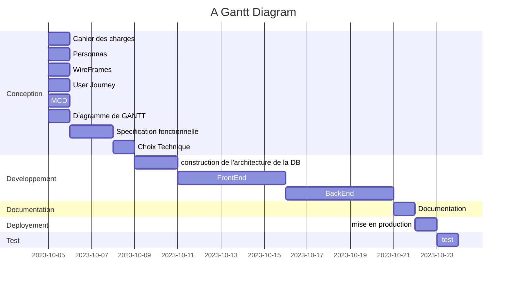
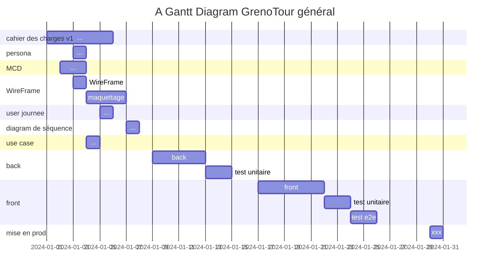
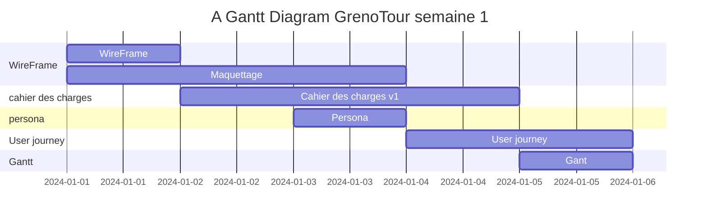
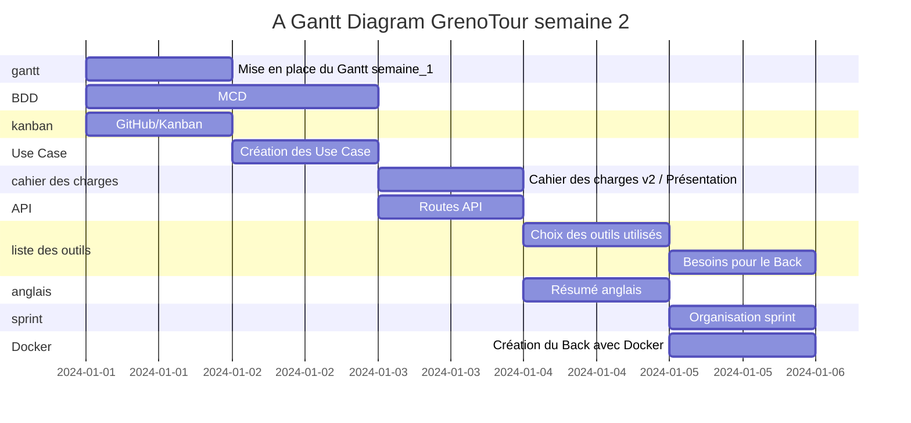

```mermaid
gantt
title A Gantt Diagram
    dateFormat  YYYY-MM-DD    
    section Conception
    Cahier des charges           :a1, 2023-10-05, 0.5d
    Personnas                    :a2, 2023-10-05, 0.5d
    WireFrames         :a3, 2023-10-05  , 0.5d
    User Journey        :a4, 2023-10-05  , 0.5d
    MCD             :a5, 2023-10-05 , 0.5d
    Diagramme de GANTT      :a6, 2023-10-05  , 0.5d
    Specification fonctionnelle  :a7, after a6  , 2d
    Choix Technique      :a8, after a7  , 1d

    section Developpement
    construction de l'architecture de la DB       :a9, after a8, 2d
    FrontEnd       :a10, after a9, 5d
    BackEnd      :a11, after a10, 5d    

    
    Section Documentation
    Documentation     : a12, after a11, 1d

    section Deployement
    mise en production       :a13, after a12, 1d

    section Test
    test  : a14, after a13, 1d
    
    
```

```mermaid
gantt
    title A Gantt Diagram GrenoTour général
    dateFormat  YYYY-MM-DD
    section cahier des charges v1
    ...      :a1, 2024-01-01, 5d
    section persona
    ...      :2024-01-03  , 1d
    section MCD
    ...      :2024-01-02  , 2d
    section WireFrame
    WireFrame  :2024-01-03  , 1d
    maquettage : 3d
    section user journee
    ...      :2024-01-05  , 1d
    section diagram de séquence
    ...     :2024-01-07  , 1d
    section use case
    ...     :2024-01-04  , 1d


    section back
    back      :2024-01-9  , 4d
    test unitaire      : 2d
    section front
    front      :2024-01-17  , 5d
    test unitaire      : 2d
    test e2e     : 2d
    section mise en prod
    xxx      :2024-01-30  , 1d
```

```mermaid
gantt
    title A Gantt Diagram GrenoTour semaine 1
    dateFormat  YYYY-MM-DD
    section WireFrame
    WireFrame  :a1, 2024-01-01, 1d
    Maquettage : 2024-01-01,3d

    section cahier des charges 
    Cahier des charges v1 :a1, 2024-01-02, 3d
    section persona
    Persona :a1, 2024-01-03, 1d
    section User journey
    User journey :a1, 2024-01-04, 2d
    section Gantt
    Gant :a1 ,2024-01-05, 1d
     
```

```mermaid
gantt
    title A Gantt Diagram GrenoTour semaine 2
    dateFormat  YYYY-MM-DD
    section gantt
    Mise en place du Gantt semaine_1     :a1, 2024-01-01, 1d
    section BDD
    MCD      :a1, 2024-01-01, 2d
    section kanban
    GitHub/Kanban      :a1, 2024-01-01, 1d

    section Use Case
    Création des Use Case      :a1, 2024-01-02, 1d

    section cahier des charges
    Cahier des charges v2 / Présentation      :a1, 2024-01-03, 1d
    section API
    Routes API      :a1, 2024-01-03, 1d

    section liste des outils
    Choix des outils utilisés      :a1, 2024-01-04, 1d
    Besoins pour le Back : 2024-01-05, 1d
    section anglais
    Résumé anglais      :a1, 2024-01-04, 1d

    section sprint
    Organisation sprint     :a1, 2024-01-05, 1d
    section Docker
    Création du Back avec Docker      :a1, 2024-01-05, 1d
```