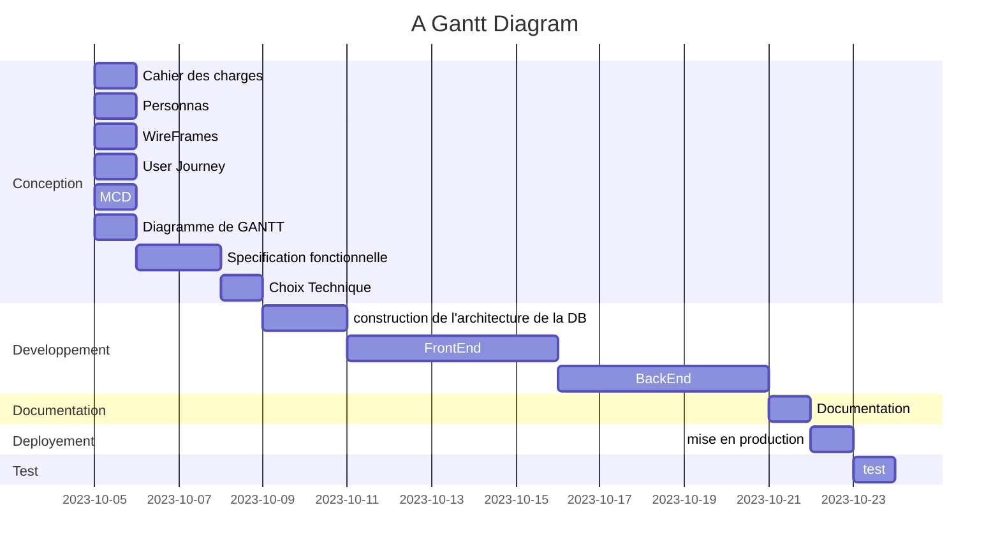

```mermaid
gantt
title A Gantt Diagram
    dateFormat  YYYY-MM-DD    
    section Conception
    Cahier des charges           :a1, 2023-10-05, 0.5d
    Personnas                    :a2, 2023-10-05, 0.5d
    WireFrames         :a3, 2023-10-05  , 0.5d
    User Journey        :a4, 2023-10-05  , 0.5d
    MCD             :a5, 2023-10-05 , 0.5d
    Diagramme de GANTT      :a6, 2023-10-05  , 0.5d
    Specification fonctionnelle  :a7, after a6  , 2d
    Choix Technique      :a8, after a7  , 1d

    section Developpement
    construction de l'architecture de la DB       :a9, after a8, 2d
    FrontEnd       :a10, after a9, 5d
    BackEnd      :a11, after a10, 5d    

    
    Section Documentation
    Documentation     : a12, after a11, 1d

    section Deployement
    mise en production       :a13, after a12, 1d

    section Test
    test  : a14, after a13, 1d
    
    
```