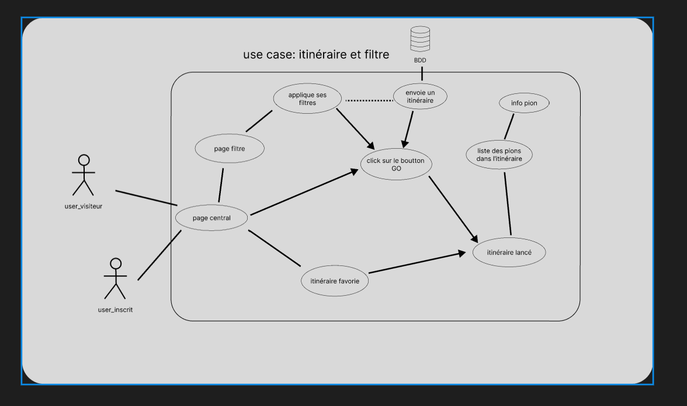
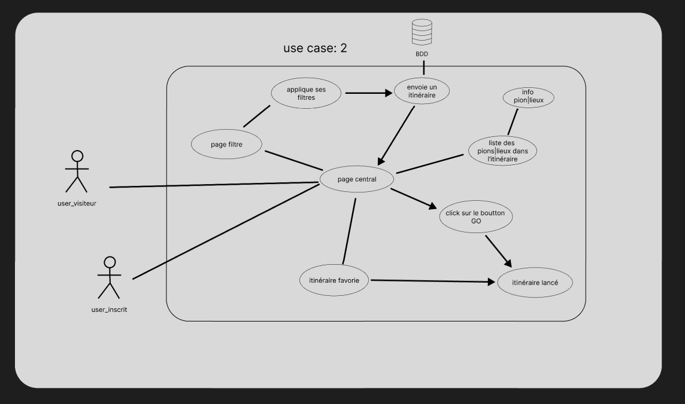
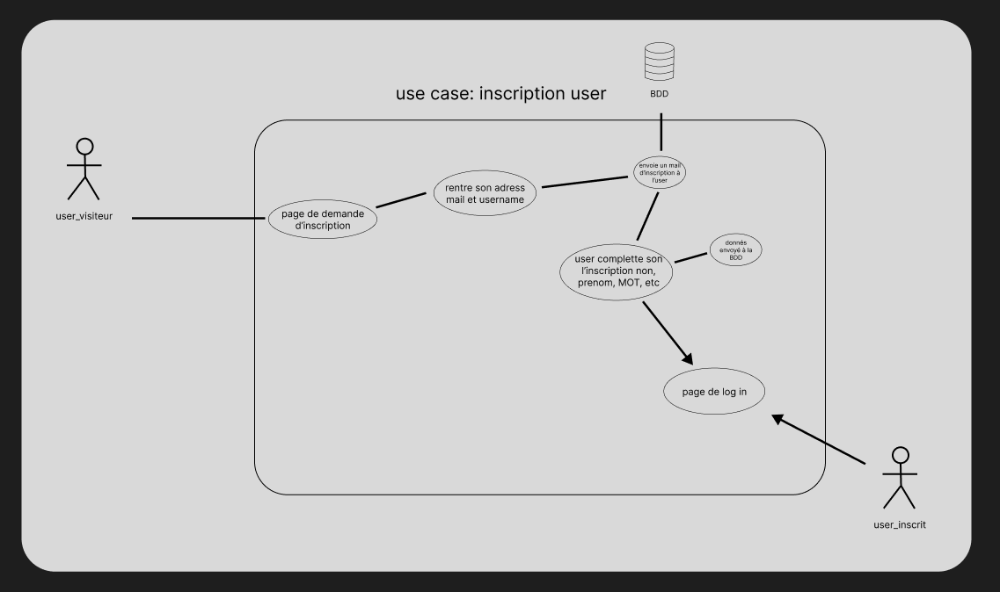
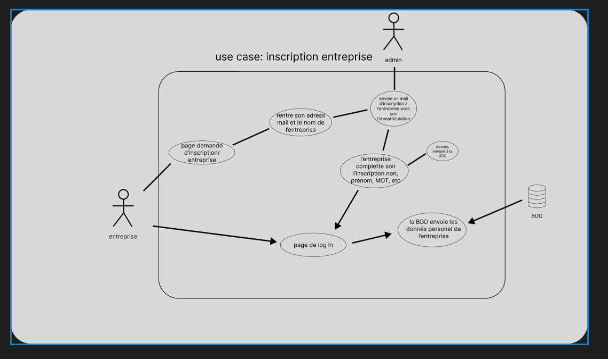

### use case: itinéraire 1 

### use case: itinéraire 2

### use case: inscription user (pour le jury)

### use case: inscription entreprise (pour le jury)

lien figma: https://www.figma.com/file/FYNTpyxItgUbDzUWek4prM/use-case-GrenoTour?type=design&mode=design&t=NXGbM0vwvaezTWsM-0