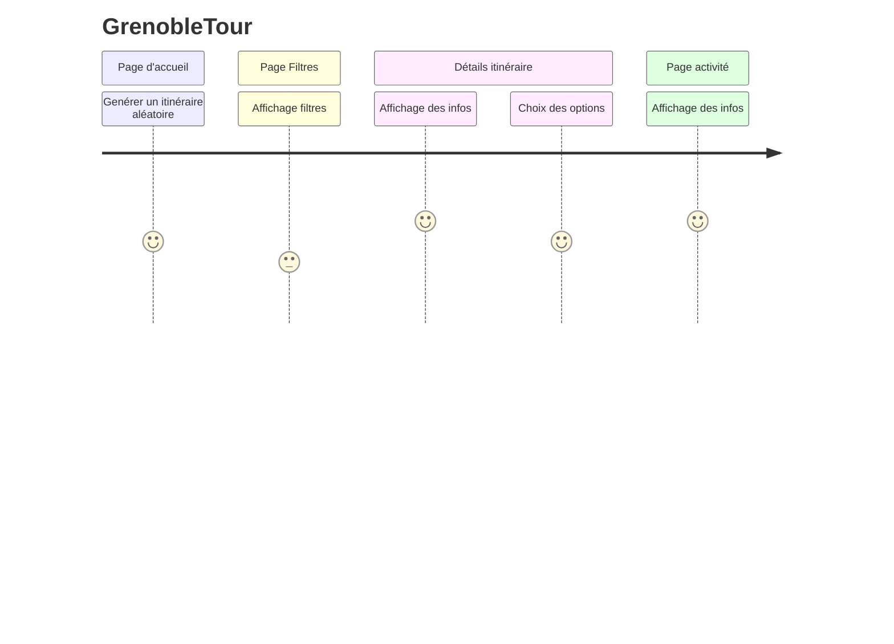

# User journey : retour n°2

## Remarques et points d'améliorations :

- page d'accueil : enregistrement de mon itinéraire / fonction favoris? / partage sur les réseaux / ajout point GPS utilisateurs / réflexion sur organisation de bas de page = ordre des logos pour meilleure ergonomie
- page filtres : ajout de filtres temporels (heure de départ/heure de fin) / choix des transports / option retour au point de départ (boucle)
- page détails itinéraire : ajout et modification de logos pertinents et compréhensifs au premier regard
