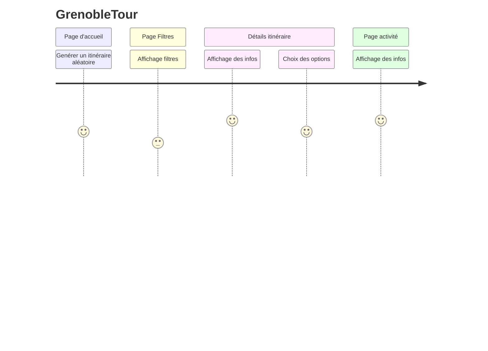
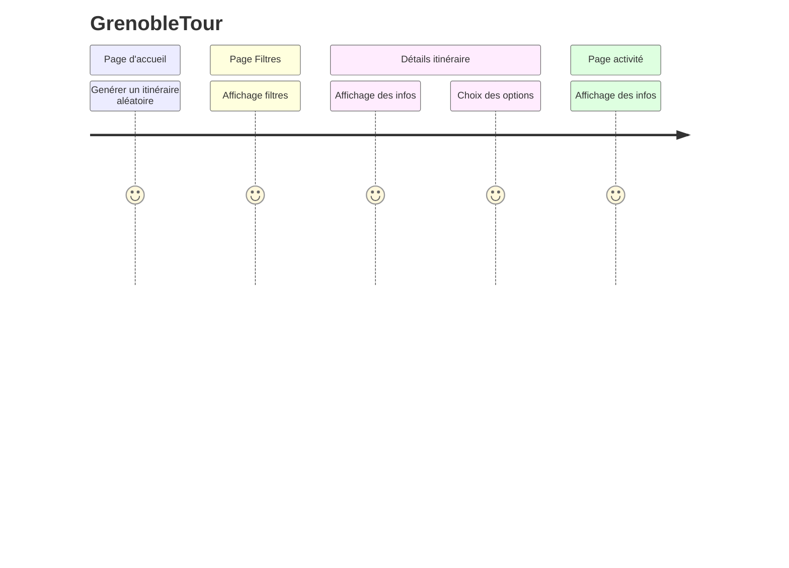

# User journey : retour n°2

## Remarques et points d'améliorations :

- page d'accueil : enregistrement de mon itinéraire / fonction favoris? / partage sur les réseaux / ajout point GPS utilisateurs / réflexion sur organisation de bas de page = ordre des logos pour meilleure ergonomie
- page filtres : ajout de filtres temporels (heure de départ/heure de fin) / choix des transports / option retour au point de départ (boucle)
- page détails itinéraire : ajout et modification de logos pertinents et compréhensifs au premier regard

# User journey : retour n°3

## Remarques et points d'améliorations :
- réflexions sur tuto explicatif lors de la première utilisation = vignettes sous forme de popups => à ajouter pour visualisation

## Résultats wireframes V3 

- (images wireframes à ajouter) 

[Lien sauvegarde Figma wireframe V3 du 12/12/23](https://www.figma.com/file/IVR2ZN3Dke1kMrHNC1vmTb/maquette_GrenoTout_Mobile-(groupe)?type=design&node-id=0-1&mode=design&t=lBUzhfJwjIvHH9Qp-0 "Wireframe V3 Figma")

